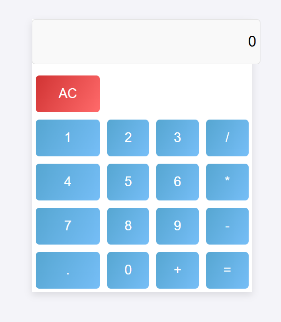

# 🧮 React Calculator

A simple calculator app built using **React 18**, **JSX**, and **Babel** — no build tools or installations required. This app runs 100% in the browser using CDNs, making it perfect for learning or small-scale demos.

---

## 📸 Screenshot
<a href="kadir001.github.io/calculator/">CLICK HERE</a>

---

## 🔧 Features

- ✅ Built with React 18 using JSX
- ✅ Runs entirely in the browser
- ✅ No npm, Webpack, or Node.js needed
- ✅ External CSS for clean styling
- ✅ Supports basic arithmetic operations (`+`, `-`, `*`, `/`)
- ✅ Easily deployable with GitHub Pages

---

📜 License
MIT © 2025 Kadir
Free to use for educational and personal projects.

